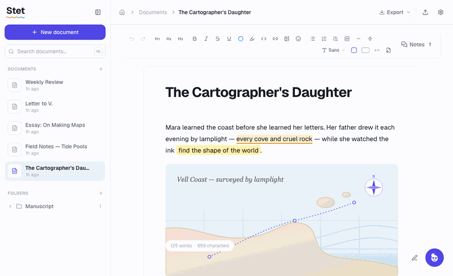
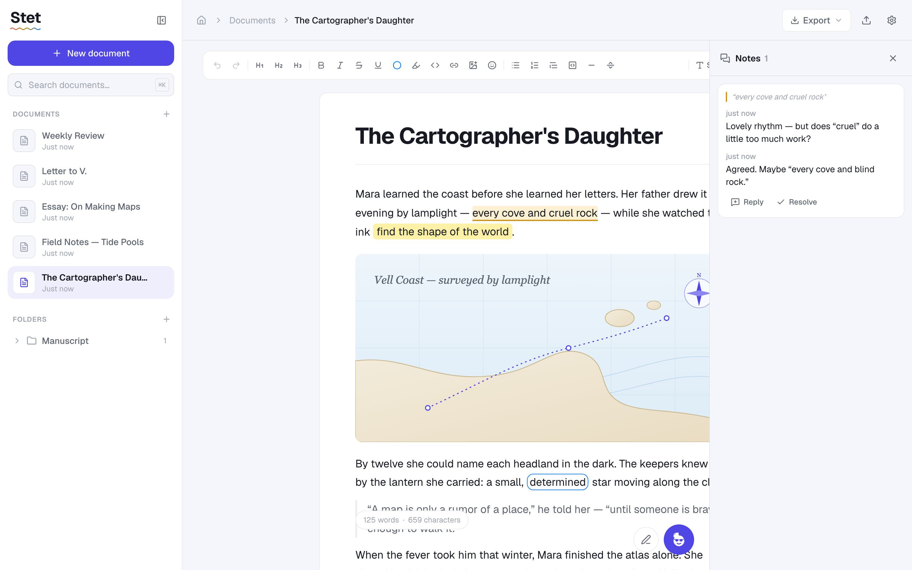
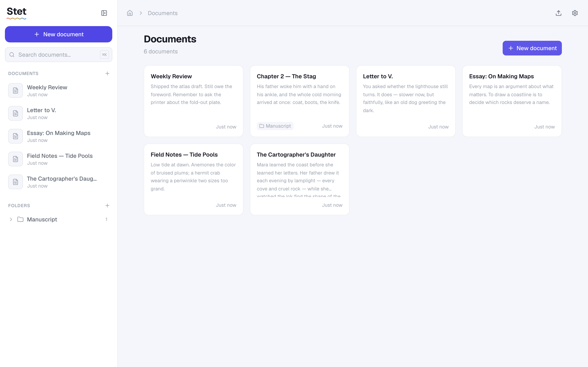

<div align="center">

# Stet

**An open source, local-first document editor with an AI that marks up your writing like a human editor.**

Highlights, circles, wavy underlines, margin notes — suggestions you can see and accept, not a chatbot that rewrites behind your back. Your documents are plain files on your disk. Bring your own API key.



<br />

**[▶ Try the live demo](https://stetai.vercel.app)** &nbsp;·&nbsp; runs entirely in your browser, no install, no account

</div>

---

## Why Stet

Most “AI writing tools” either rewrite your text for you or bury edits in a chat panel. Stet treats the AI like a **copy editor working on paper**: it marks *where* something could be better and *why*, and the change only happens when **you** accept it.

- **Local-first.** Documents are real files on disk (`~/Stet` by default) — one `.json` per doc plus a readable `.md` sibling. Clear your browser cache, use incognito, switch machines: nothing is lost. No account, no server, no telemetry.
- **Bring your own key.** AI calls go **browser → your provider** (Anthropic, OpenAI, or Gemini) using a key you paste in Settings. It lives in `localStorage` only and never touches a Stet server — there isn’t one.
- **Markup, not mutation.** AI suggestions are ProseMirror decorations. Your document’s content changes only when you accept a suggestion.
- **Calm, Craft-inspired design.** A floating page, generous whitespace, light or dark (plus reading/forest/midnight themes). No shadows — depth comes from surface contrast and hairline borders.

## Features

- ✍️ **Rich text editor** (TipTap) — headings, lists, quotes, code, links, emoji, images, page breaks
- 🤖 **AI review** — grammar fixes, style suggestions, highlights, and circled passages you accept or dismiss
- 🖊️ **Human markup tools** — highlight, colored underline, circle, all as real document marks
- 💬 **Notes** — Google-Docs-style comments anchored to text, in a right-side panel
- 🖼️ **Images** — insert, paste, or drag-and-drop; stored on disk beside your docs
- 📄 **Pages & typography** — continuous or paginated (A4/Letter), free-form width, four document fonts, text-size control
- 📁 **Folders & library** — a Home dashboard and a card-grid `/documents` view
- 📤 **Export** — Markdown, Word (`.docx`), HTML, plain text, and PDF
- 📥 **Import** — Markdown, text, HTML, and Word (`.docx`)
- 🌗 **Themes** — light, dark, midnight, reading, forest — all token-driven

<div align="center">


</div>

## Quick start

You need **Node 20+**.

```bash
git clone https://github.com/filu123/stet.git
cd stet
npm install
npm run dev
```

Open <http://localhost:3000> and start writing. That’s it — documents are saved to `~/Stet` automatically.

To use the AI features, open **Settings** (gear icon, top-right), choose a provider, and paste your API key.

### Where your documents live

By default, Stet writes to `~/Stet`. Point it somewhere else with an env var:

```bash
STET_DATA_DIR=~/Documents/Stet npm run dev
```

Each document is a pretty-printed `<id>.json` (the canonical source) plus a `<slug>.<id>.md` sibling you can read or grep. Folders are real subdirectories; images live in `<STET_DATA_DIR>/images`. Back it up like any other folder.

> **No server for your data.** The Next.js app *is* the local server that reads and writes that folder. If you deploy Stet to an ephemeral host instead, it transparently falls back to in-browser storage (IndexedDB).

### Deploy a hosted instance

For a shareable, no-install instance (like the live demo), deploy to Vercel and set **`STET_STORAGE_MODE=browser`** so documents persist in each visitor's own browser instead of a disappearing serverless disk:

[](https://vercel.com/new/clone?repository-url=https%3A%2F%2Fgithub.com%2Ffilu123%2Fstet&env=STET_STORAGE_MODE&envDescription=Set%20to%20%22browser%22%20for%20a%20hosted%20demo)

Everything stays client-side and BYO-key — a hosted Stet never sees your documents or your API key.

## Privacy

- **No telemetry, no analytics, no accounts.** Stet never phones home.
- **Your API key** is read from `localStorage` at call time and sent only to the provider you chose. It never enters a document, an export, a log, or an error message.
- **Your writing** stays on your machine. The only text that leaves is what you send to your AI provider when you run a review — using your own key, under their policy.

## Tech

Next.js 16 (App Router, Turbopack) · TypeScript (strict) · Tailwind v4 · TipTap / ProseMirror · Zustand · Vitest. No backend service, no database server.

```bash
npm run dev     # start the dev server
npm run lint    # ESLint (zero warnings)
npm run build   # production build
npm test        # Vitest unit tests
```

## Contributing

Stet is developed by a single maintainer with a specific vision, and **every change is reviewed and merged by the maintainer**. Pull requests are welcome but not guaranteed to be merged — please **open an issue to discuss first** so we don’t both waste effort. See [CONTRIBUTING.md](CONTRIBUTING.md) before opening one.

## License

[GNU AGPL-3.0](LICENSE). You’re free to use, study, self-host, and modify Stet. If you run a modified version as a network service, you must make your source available under the same license. This keeps Stet open for everyone and prevents it from being taken closed-source.
